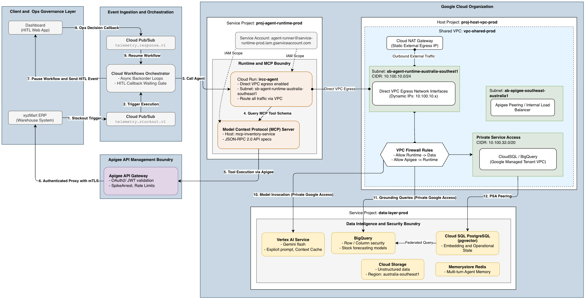

# Inventory Recovery & Customer Compensation (IRCC) System

[](https://cloud.google.com/run)
[](https://github.com/google/adk)
[](https://www.python.org/)
[](https://modelcontextprotocol.io/)

The **Inventory Recovery & Customer Compensation (IRCC)** system is an enterprise autonomous agentic platform built for **xyzMart**. It processes real-time telemetry stockout events via Google Cloud Pub/Sub, evaluates customer loyalty tiers, automatically searches alternative inventory, and triggers high-priority vendor backorders or manager approval workflows.

---

## 🏗️ Solution Design Architecture

The system utilizes an event-driven agentic architecture deployed on Google Cloud Platform (GCP). Out-of-stock inventory events trigger an automated workflow that passes context to an autonomous agent powered by the **Google Agent Development Kit (ADK)** and Gemini LLM.



### Core Components

| Component | Tech / Service | Description |
| :--- | :--- | :--- |
| **Telemetry Ingestion** | GCP Pub/Sub | Receives real-time out-of-stock event notifications (`telemetry.stockout.v1`). |
| **Event Routing** | GCP Eventarc | Listens for Pub/Sub messages and triggers Cloud Workflows. |
| **Orchestration Workflow** | GCP Cloud Workflows | Decodes Pub/Sub payload and invokes the ADK Agent endpoint on Cloud Run. |
| **Autonomous Agent** | Google ADK / Gemini LLM | Evaluates inventory state, loyalty tiers, and determines remediation strategy (`proto/ircc_agent/agent.py`). |
| **MCP Server** | Model Context Protocol (`mcp`) | Decouples tool execution (`xyzmart_mcp_server.py`) using JSON-RPC stdio protocol. |
| **Data Layer** | SQLite (Local) / Enterprise APIs | Provides customer loyalty profiles and SKU availability data (`xyzmart.db`). |

---

## 🤖 System Agent Details (`/proto`)

The core intelligence resides in the `/proto` directory:

- **[agent.py](proto/ircc_agent/agent.py)**: Defines the primary `ircc_agent` using Google ADK. It encapsulates the core decision logic:
  - **VIP Loyalty Tiers (Gold/Platinum)**: Automatically attempts high-priority vendor backorder (`submit_backorder`).
  - **Standard Loyalty Tier**: Queries in-stock replacement SKUs (`inventory_search`). If unavailable, issues vendor backorder.
  - **Approval Handling**: Catches `APPROVAL_REQUIRED` status for high-value orders and returns manager approval request tracking IDs.
- **[xyzmart_mcp_server.py](proto/ircc_agent/xyzmart_mcp_server.py)**: Exposes standard MCP tools over `stdio`:
  - `get_customer_loyalty`: Retrieves customer tier based on ID.
  - `inventory_search`: Searches inventory database for substitute items.
  - `submit_backorder`: Submits backorders to vendor systems with tier-based priority.
- **[db_helper.py](proto/ircc_agent/utils/db_helper.py)**: Manages local mock database initialization (`xyzmart.db`).

---

## 💻 Local Setup & Execution Guide (`/proto`)

Follow these steps to run and test the ADK Agent locally on your development machine.

### Prerequisites

- **Python**: Version 3.10 or higher
- **GCP API Key**: A valid Gemini / Google AI Studio API key (`GOOGLE_API_KEY`)

### Step-by-Step Local Setup

1. **Navigate to the Prototype Directory**:
   ```bash
   cd proto
   ```

2. **Create and Activate Virtual Environment**:
   ```bash
   python3 -m venv .venv
   source .venv/bin/activate
   ```

3. **Install Dependencies**:
   ```bash
   pip install -r ircc_agent/requirements.txt
   ```

4. **Configure Environment Variables**:
   Create or edit `proto/.env` (or set environment variables in your terminal session):
   ```bash
   export GOOGLE_API_KEY="your-gemini-api-key-here"
   export APP_ENV="LOCAL"
   export ADK_MODEL_NAME="gemini-3.1-flash-lite"
   ```

5. **Run ADK Agent Web Interface**:
   Start the interactive ADK web developer interface to test prompt triggers and tool invocations:
   ```bash
   adk web ircc_agent
   ```
   > [!TIP]
   > Access the interactive web interface at `http://localhost:8000` to simulate stockout events and visually trace MCP tool calls.

6. **Run ADK Agent via CLI**:
   Alternatively, run the agent in CLI mode:
   ```bash
   adk run ircc_agent
   ```
7. **Enter following sample stockout event to test the agent**:
   Ref: [SAMPLE STOCKOUT EVENTS](proto/ircc_agent/mock-data/stockout_events.json) for pub/sub schema and [DB SCHEMA](proto/ircc_agent/mock-data/db-setup.sql) for sqlite3 database schema.
   ```json
   {
    "event": "OUT_OF_STOCK", 
    "sku": "PROD-505-LTD", 
    "customerId": "3", 
    "required_quantity": 4
   }
   ``` 
---

## ☁️ GCP Cloud Deployment (`proto/deploy.sh`)

The automated deployment script [proto/deploy.sh](proto/deploy.sh) provisions all GCP infrastructure, builds the ADK container on Cloud Run, configures Cloud Workflows, and attaches Eventarc triggers.

### Automated Infrastructure Provisioned

1. **GCP API Activation**: Enables Cloud Run, Cloud Build, Artifact Registry, AI Platform, Cloud Workflows, Eventarc, and Pub/Sub.
2. **Pub/Sub Topic**: Creates `telemetry.stockout.v1`.
3. **Cloud Run Service**: Deploys `ircc-agent-service` hosting the ADK agent container.
4. **IAM & Service Account**: Provisions `agent-runner` service account with strictly scoped IAM roles (`eventReceiver`, `workflows.invoker`, `run.invoker`, `logWriter`).
5. **Cloud Workflows**: Deploys [workflow.yaml](specialization/workflow.yaml) to process event payloads and invoke Cloud Run endpoints securely via OIDC.
6. **Eventarc Trigger**: Connects Pub/Sub messages directly to Cloud Workflows execution.

### Execution Command

Ensure you have authenticated with GCP and selected your billing-enabled project:

```bash
# 1. Authenticate with Google Cloud
gcloud auth login
gcloud auth application-default login

# 2. Navigate to proto directory & execute deployment script
cd proto
chmod +x deploy.sh
./deploy.sh
```

### Environment Parameters in `deploy.sh`

Customize deployment variables inside `proto/deploy.sh` before running:

```bash
export PROJECT_ID="your-gcp-project-id"
export REGION="australia-southeast1"
export SERVICE_NAME="ircc-agent-service"
export TOPIC_NAME="telemetry.stockout.v1"
export SERVICE_ACCOUNT_NAME="agent-runner"
export WORKFLOW_NAME="ircc-workflow"
```

### Cloud Run Min Instances & CPU Allocation

* `--min-instances=2`: Eliminates serverless cold-start delays for critical path event consumers.
* `--no-cpu-throttling`: Ensures dedicated CPU availability even during idle background processing, enabling high-performance gRPC connection pooling.
* **Concurrency Settings**: Configured to 80 concurrent requests per container to optimize memory footprint during peak stockout bursts.


---

## 🚀 Architectural & Security Improvements

While the prototype provides robust autonomous out-of-stock resolution, the following production enhancements are recommended:

### 1. 🔄 Cloud Workflow Improvements

* **Dynamic Service URL Discovery**:
  - *Current State*: [specialization/workflow.yaml](specialization/workflow.yaml) uses a hardcoded Cloud Run URL (`cloud_run_url`).
  - *Improvement*: Inject the Cloud Run service URL dynamically during workflow deployment using `gcloud workflows deploy --set-env-vars` or Workflow execution parameters.
* **Resilience & Retry Policies**:
  - Implement explicit `try/retry` blocks with exponential backoff in Cloud Workflows for handling transient HTTP 5xx errors or LLM rate limits during agent invocation.
* **Dead-Letter Queue (DLQ)**:
  - Attach a Pub/Sub Dead-Letter Queue to catch unprocessable or malformed telemetry events without blocking main pipeline execution.
* **Asynchronous Human-in-the-Loop Callback**:
  - For backorders requiring manager approval (`APPROVAL_REQUIRED`), enhance Cloud Workflows with HTTP callback endpoints to pause execution and wait for asynchronous manager approval before notifying vendor systems.

### 2. 🛡️ Shared VPC & Enterprise Network Security

* **Shared VPC Integration**:
  - Deploy Cloud Run and Cloud Workflows inside a centralized **GCP Shared VPC Host Project**, managed by corporate network security teams, separating dev/staging/prod service projects.
* **Direct VPC Egress & Private Service Connect (PSC)**:
  - Attach a Direct VPC Egress connector to Cloud Run to route all outbound traffic internally to private enterprise databases, inventory systems, and vendor endpoints without exposing traffic to the public internet.
* **Ingress Access Control**:
  - Restrict Cloud Run service ingress to `--ingress=internal-and-cloud-load-balancing` so that the agent endpoint cannot be reached directly via public IP.
* **Secret Manager Integration**:
  - Migrate sensitive environment variables (such as `GOOGLE_API_KEY` and database credentials) from deployment scripts into **GCP Secret Manager**, binding them securely to Cloud Run at runtime via IAM.

#### 🌐 Network Addressing & Subnet Topology Plan

| Network Subnet / Range | Project | CIDR Block / Routing | Purpose | Scope |
| :--- | :--- | :--- | :--- | :--- |
| `sb-agent-runtime-australia-southeast1` | Host Project | `10.100.10.0/24` | Cloud Run Direct VPC Egress & MCP Server Endpoints | `australia-southeast1` |
| `sb-apigee-australia-southeast1` | Host Project | `10.100.15.0/24` | Apigee VPC Peering & Internal Load Balancers | `australia-southeast1` |
| `sb-data-layer-australia-southeast1` | Host Project | `10.100.20.0/24` | Memorystore Redis, PSC Endpoints | `australia-southeast1` |
| `psa-google-managed-services` | Host Project | `10.100.32.0/20` | Cloud SQL, PostgreSQL (Private Service Access) | Global Peering |
| `Private Google Access` | Host Project | Global Route | Backbone access to Vertex AI, BigQuery, Pub/Sub | Global |


### 3. 🔌 Enterprise API Gateway & Apigee Integration

* **Apigee API Management Migration**:
  - *Current State*: The local [xyzmart_mcp_server.py](proto/ircc_agent/xyzmart_mcp_server.py) executes direct database queries (`xyzmart.db`) for mock testing and local prototyping purposes only.
  - *Production Requirement*: Direct database access from the MCP server must be replaced with enterprise API calls managed via an **Apigee API Management** server rather than direct DB queries.
* **OAuth 2.0 Security & Governance**:
  - All inventory searches, loyalty queries, and vendor backorder submissions must route through Apigee API proxies secured with **OAuth 2.0** access tokens (Client Credentials grant flow), providing centralized API governance, mTLS, rate limiting, and real-time audit logging.

### 4. ⚡ Agent Context Caching & State Persistence (GCP Memorystore for Redis)

* **External Redis Context Caching**:
  - *Current State*: Session state and conversation context are maintained in local Cloud Run container memory during agent execution.
  - *Production Requirement*: Move agent context caching, session state management, and prompt cache storage out to a dedicated **GCP Memorystore for Redis** cluster.
  - *Benefits*: Supports stateless Cloud Run horizontal autoscaling, lowers LLM invocation latency via prompt caching, ensures session durability across container restarts, and provides high-throughput shared state across multi-turn agent interactions.

---

## 📁 Repository Directory Structure

```
ircc-system/
├── README.md                                   # Root System Documentation
├── docs/
│   └── ircc-system-high-level-architecture.drawio.png # Architecture Diagram
├── proto/
│   ├── deploy.sh                               # Automated GCP Deployment Script
│   └── ircc_agent/
│       ├── agent.py                            # ADK Agent Definition & Prompt Logic
│       ├── xyzmart_mcp_server.py               # MCP Tool Server (JSON-RPC stdio)
│       ├── xyzmart_mcp_server_specs.json       # MCP Tool Specification Schema
│       ├── requirements.txt                    # Python Dependencies
│       ├── mock-data/                          # Local Test Database & SQL Schema
│       └── utils/                              # Database Initialization Utilities
└── specialization/
    ├── apigee.md                               # Apigee Proxy rules and security profiles
    ├── pub_sub_msg_schema.json                 # Pub/Sub Message Schema
    ├── workflow.yaml                           # GCP Cloud Workflow Definition
    └── xyzmart_mcp_server_specs.json           # MCP Tool Specification Schema
```

---

## 👤 Author

**Dharmik Chauhan**

